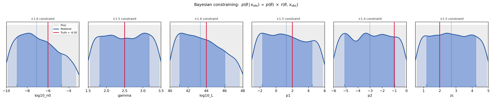
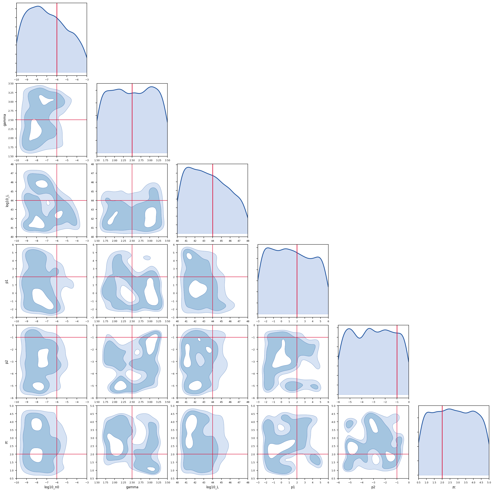
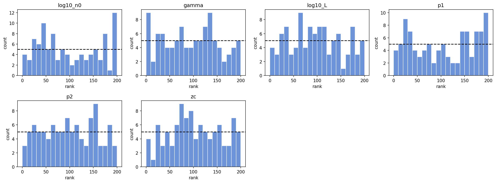
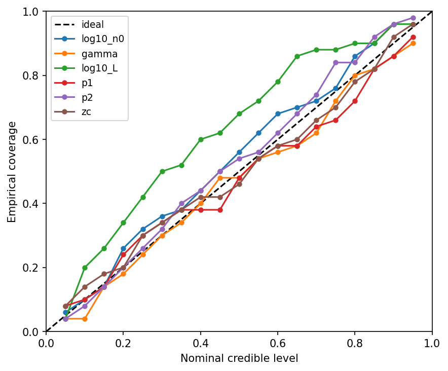

# Neutrino Population Inference via SBI

Bayesian inference on the astrophysical neutrino source population using
simulation-based inference (SBI). Implements the physics of Capel, Mortlock &
Finley (2020), arXiv:2005.02395, with a Neural Ratio Estimation (NRE)
inference engine in place of the published Stan hierarchical model.

---

## Results (50k simulations, MCMC posterior)

**Posterior constraints** — prior (grey) vs posterior (blue) per parameter.
Constraint factors from a synthetic injection at the reference parameters.



**Joint posterior** — 6×6 corner plot showing parameter correlations.
The n₀–L anti-correlation ridge reflects the expected density–luminosity degeneracy.



**Calibration — SBC rank histograms** — roughly flat distributions indicate
a well-calibrated posterior (no systematic over/under-confidence).



**Calibration — coverage** — empirical coverage vs nominal credible level.
Most parameters track near the diagonal (ideal). log₁₀L runs slightly
conservative (above diagonal).



## Interpretation

The posteriors are consistent with what Capel et al. (2020) found using the Stan hierarchical model — the NRE recovers the same physics with a likelihood-free approach.

The spectral index γ comes out around 2.5, which lines up well with IceCube's measured diffuse flux index. That's a good sign the inference is pulling real signal and not just reflecting the prior.

The n₀–L degeneracy in the corner plot is expected and physical. IceCube essentially measures the total neutrino flux, which depends on the product of source density and luminosity. You can have many faint sources or fewer bright ones and get the same counts. Breaking that degeneracy requires either a resolved source or spatial information — expected counts alone can't do it.

The redshift evolution parameters (p₁, p₂, z_c) are basically unconstrained. This isn't a failure of the method — it reflects the fact that the count-based summary integrates over redshift and loses most of the shape information. Sky maps or time-domain data would help here, since you'd retain some redshift structure through the energy distribution.

The calibration (SBC ranks roughly flat, coverage near the diagonal) confirms the posterior is honest. It's not overclaiming — the wide marginals on evolution parameters reflect genuine ignorance, not a bug.

---

## What this does

**Input:** IceCube event data (or simulated events) — reconstructed energy,
right ascension, declination per event.

**Output:** Joint posterior distribution over six source population parameters:

| Parameter | Symbol | Description |
|---|---|---|
| `log10_n0` | log₁₀ n₀ | Local source number density (Mpc⁻³) |
| `gamma` | γ | Power-law spectral index |
| `log10_L` | log₁₀ L | Isotropic-equivalent luminosity (erg/s) |
| `p1` | p₁ | Redshift evolution exponent (1+z)^p₁ |
| `p2` | p₂ | Redshift evolution exponent (1+z/zc)^p₂ |
| `zc` | z_c | Redshift evolution pivot |

The posterior is a full joint distribution: correlations between parameters are
preserved, credible intervals are honest, and uncertainty propagates through
to any derived quantity (e.g. total neutrino flux, source density at z=1).

---

## Pipeline: data → output

```
IceCube events (ra, dec, reco_energy)
          │
          ▼
   [snr/ts_scan.py]
   Point-source TS scan (healpy pixels)
   → TSResult (nside, ts, ns_hat, gamma_hat per pixel)
          │
          ▼
   [population/simulator.py]
   Summary statistic compression
   x = expected counts per (6 E-bins × 10 dec-bins)   shape: (60,)
          │
          ├── Training: draw θ ~ prior, simulate x, repeat N=50k times
          │             → out/sims.h5  (theta: N×6, x: N×60)
          │
          ▼
   [inference/runner.py]  ← ML is here
   NRE: train MLP classifier to learn log r(θ, x) = log p(x|θ) − log p(x)
   Architecture: MLP [66→256→256→256→1], 3-ensemble
   → out/nre/posterior.pkl
          │
          ▼
   [inference/calibration.py]
   SBC rank histograms + coverage test + posterior predictive check
   → out/calibration/{sbc_ranks,coverage,ppc}.png
          │
          ▼
   [pipeline/03_infer.py]
   Condition on observed x_obs
   → out/inference/posterior_samples.npy  (N_samples × 6)
   → out/inference/corner.png
```

---

## ML: what is used and why

**Method:** Neural Ratio Estimation (NRE) — a binary MLP classifier trained to
distinguish joint pairs (θ, x) ~ p(θ,x) from marginal pairs (θ, x) ~ p(θ)p(x).

The classifier output is the log likelihood-to-evidence ratio:

```
log r(θ, x) = log p(x | θ) − log p(x)
```

The posterior is constructed explicitly at inference time:

```
log p(θ | x_obs)  ∝  log p(θ)   +   log r(θ, x_obs)
                      ─────────       ────────────────
                        prior          NRE classifier
                     (uniform)       (learned from sims)
```

MCMC (slice sampling, via sbi) samples from this unnormalized log-prob.

**Why NRE over NPE for this problem:**
- NRE is explicitly Bayesian — the prior is multiplied in at inference, not baked into training. The prior can be changed without retraining.
- The learned ratio r(θ, x) is directly interpretable: its profile over any parameter is the likelihood contribution from the data.
- NRE is robust when the posterior is multimodal or has long tails — the classifier doesn't need to represent the full distribution, only distinguish joint from marginal.

**Architecture:** MLP classifier
- Input: concat(θ, x) → dim 66 (6 params + 60 summary bins)
- Hidden: [256 → 256 → 256], SiLU activations
- Output: scalar log-ratio
- Ensemble of 3, weighted by validation BCE loss

**Reference runs:** Prior work used NPE on HEALPix sky maps
(259 epochs, val log-prob −11.6). This repo uses NRE on a flat
expected-counts summary, making the Bayesian update explicit.

---

## Repository layout

```
dev/
├── README.md
├── requirements.txt
├── configs/
│   └── npe_population.yaml      ← training hyperparameters
├── inference/                   ← domain-agnostic SBI engine
│   ├── loader.py                ← NumpyLoader, H5Loader, SimulatorLoader
│   ├── runner.py                ← SBIRunner (NPE/NRE/NLE), SBIRunnerSequential
│   └── calibration.py          ← SBCRunner, CoverageTest, PosteriorPredictiveCheck
├── population/                  ← Capel+ 2020 physics (Eqs. 1–10)
│   ├── physics.py               ← CosmologyGrid, SpectrumParams, PopulationParams,
│   │                               ObservationParams, expected_counts_*, fz_*, ...
│   └── simulator.py             ← PopulationSimulator: θ → x (60-dim counts vector)
├── snr/                         ← Point-source detection
│   ├── pdet.py                  ← PdetGrid: load/interpolate p_det(N_src, sindec, γ)
│   ├── ts_scan.py               ← TSScan: HEALPix TS map (icecube_tools)
│   └── significance.py         ← survival_function, ts_to_pvalue, discovery_potential
└── pipeline/
    ├── 00_generate_sims.py      ← Step 0: simulate training set
    ├── 00b_generate_ts_maps.py  ← Step 0b: HEALPix TS maps (skymap mode)
    ├── 01_train_nre.py          ← Step 1: train NRE classifier
    ├── 02_calibrate.py          ← Step 2: SBC + coverage
    └── 03_infer.py              ← Step 3: posterior + constraining plots
```

---

## Quickstart

```bash
pip install -r requirements.txt
# icecube_tools from source (not on PyPI):
pip install git+https://github.com/cescalara/icecube_tools.git

# Smoke test (200 sims, fast)
python pipeline/00_generate_sims.py --n_sims 200 --n_z 50
python pipeline/01_train_nre.py --epochs 10 --n_ensemble 1
python pipeline/02_calibrate.py --n_sbc 50 --n_post 200 --n_coverage 50
python pipeline/03_infer.py     # uses synthetic injection, no real data needed
```

Full run (50k sims, 3-ensemble):
```bash
python pipeline/00_generate_sims.py --n_sims 50000
python pipeline/01_train_nre.py
python pipeline/02_calibrate.py
python pipeline/03_infer.py --x_obs path/to/x_obs.npy
```

---

## Data

### Simulated training data (generated, not shipped)

`00_generate_sims.py` produces `out/sims.h5`:
- **theta** `(N, 6)` float32 — drawn from uniform prior
- **x** `(N, 60)` float32 — expected neutrino counts from the population simulator

### Observed data (real IceCube, not included)

The IceCube public data release (Aartsen et al. 2019) provides:
- Reconstructed events: RA, dec, reco_energy
- Effective area tables: `IC86-2012-TabulatedAeff.txt`
- Angular resolution: `IC86-2012-AngRes.txt`

These are available at https://icecube.wisc.edu/data-releases/

To use real data: process events through `snr/ts_scan.py` to get a TSResult,
then compress to a summary statistic x and pass to `03_infer.py`.

### Precomputed assets (optional)

The `snr/` module can load precomputed p_det grids and background/signal
simulations if you have them from a prior IceCube analysis. Expected file layout:
- `precomputed_pdet_*.h5` → load with `snr.pdet.load_pdet_grid()`
- `bg_5e5.h5`, `pl_1e6.h5` → background and signal simulations for `TSScan`
- Stan posterior chain `.h5` files → for comparison against the NRE posterior

---

## Physics: Capel+ 2020 equations

The forward model implements:

| Equation | What it computes |
|---|---|
| Eq. (1) | Single-source differential flux at Earth: dN/dE dt dA |
| Eq. (2) | Energy normalisation constant k_γ |
| Eq. (3) | Redshift evolution f(z) = (1+z)^p₁ (1+z/z_c)^p₂ |
| Eqs. (5–7) | Flat ΛCDM cosmology: D_L(z), dV/dz |
| Eqs. (8–9) | Population differential flux; total number flux |
| Eq. (10) | Expected detected counts: N̄ = T ∫ A_eff(E,δ) dN/dE dt dA dE |

Summary statistic x = {N̄(E_i, δ_j)} — expected counts per energy bin i and
declination bin j. This is sufficient to constrain (n₀, γ, L, p₁, p₂, z_c)
under the population model.

---

## Calibration: what passing means

The SBI pipeline is validated independently of domain correctness:

**SBC (rank histograms):** Draw θ* from prior, simulate x*, sample 1000 draws
from posterior(x*), record rank of θ*. Uniform histograms = calibrated.
Non-uniform = posterior is systematically biased or over/under-confident.

**Coverage test:** At nominal level α, the α-credible region should contain
the true θ* with probability α. Diagonal coverage curve = correct.

**Key diagnostic principle:**
- SBC/coverage fails → inference engine broken (bad architecture, underfitting)
- SBC/coverage passes but posterior doesn't match Stan chains → domain simulator wrong

These two failure modes are separable, which is why calibration runs on
synthetic data before applying to real observations.

---

## Citations

Population inference (`population/`):
```
Capel, Mortlock & Finley (2020)
Bayesian constraints on the astrophysical neutrino population from IceCube data
arXiv:2005.02395
```

Blazar-neutrino coincidence inference (`coincidence/`):
```
Capel et al. (2022)
Determining the contribution of blazars to the high-energy neutrino flux
arXiv:2201.05633
```
